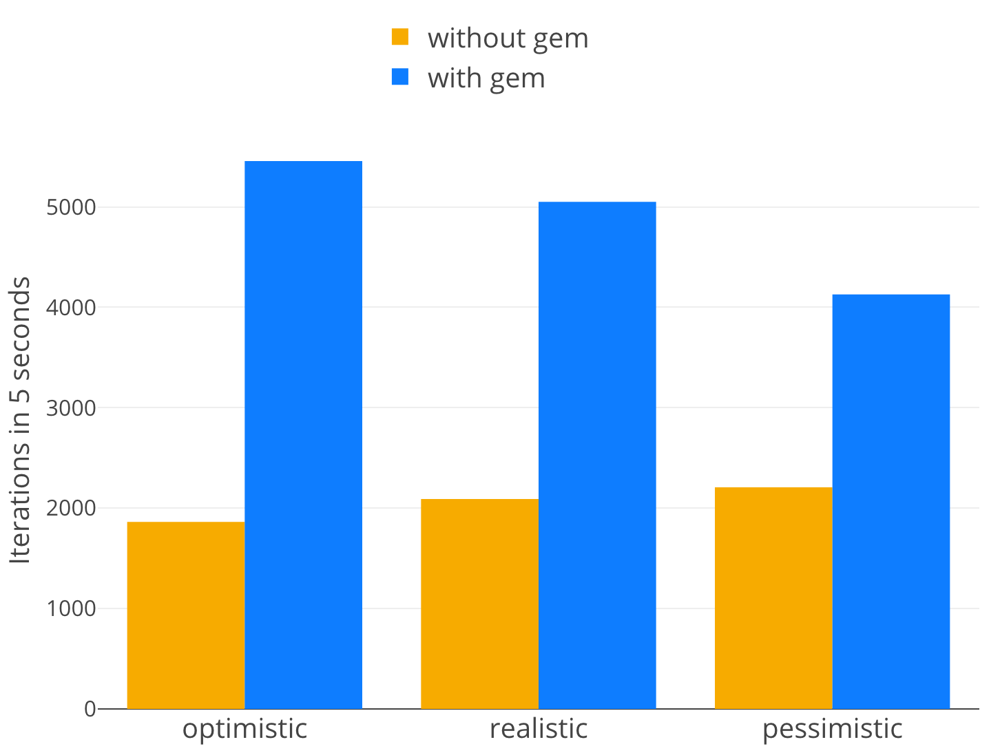
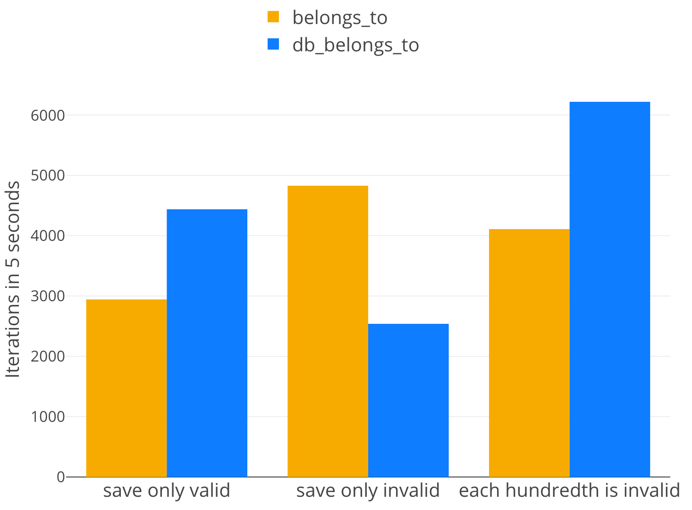
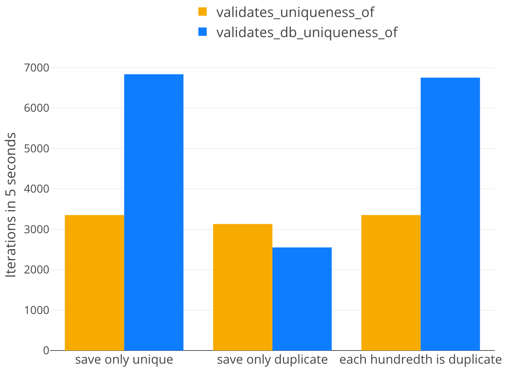

# DatabaseValidations

[](https://circleci.com/gh/toptal/database_validations/tree/master)
[](https://badge.fury.io/rb/database_validations)
[](https://codeclimate.com/github/toptal/database_validations/maintainability)

DatabaseValidations helps you to keep the database consistency with better performance.
Right now, it supports only ActiveRecord.

*The more you use the gem, the more performance increase you have. Try it now!*

## Installation

Add this line to your application's Gemfile:

```ruby
gem 'database_validations'
```

And then execute:

```bash
bundle
```

Or install it yourself as:

```bash
gem install database_validations
```

Have a look at [example](example) application for details.

## Benchmark ([code](benchmarks/composed_benchmarks.rb))

Image, you have `User` model defines as

```ruby
class User < ActiveRecord::Base
  validates :email, :full_name, uniqueness: true

  belongs_to :company
  belongs_to :country
end
```

and then replace with

```ruby
class User < ActiveRecord::Base
  validates :email, :full_name, db_uniqueness: true
  # OR
  # validates_db_uniqueness_of :email, :full_name

  db_belongs_to :company
  db_belongs_to :country
  # OR
  # belongs_to :company
  # belongs_to :country
  # validates :company, :country, db_presence: true
end
```

you will get the following performance improvement:



## db_belongs_to

Supported databases are `PostgreSQL` and `MySQL`.
**Note**: Unfortunately, `SQLite` raises a poor error message
by which we can not determine exact foreign key which raised an error.

### Usage

```ruby
class User < ActiveRecord::Base
  db_belongs_to :company
end

user = User.create(company_id: nil)
# => false
user.errors.messages
# => {:company=>["must exist"]}
```

### Problem

ActiveRecord's `belongs_to` has `optional: false` by default. Unfortunately, this
approach does not ensure existence of the related object. For example, we can skip
validations or remove the related object after we save the object. After that, our
database becomes inconsistent because we assume the object has his relation but it
does not.

`db_belongs_to` solves the problem using foreign key constraints in the database
also providing backward compatibility with nice validations errors.

### Pros and Cons

**Advantages**:
- Ensures relation existence because it uses foreign keys constraints.
- Checks the existence of proper foreign key constraint at the boot time.
Use `ENV['SKIP_DB_UNIQUENESS_VALIDATOR_INDEX_CHECK'] = 'true'` if you want to
skip it in some cases. (For example, when you run migrations.)
- It's almost two times faster because it skips unnecessary SQL query. See benchmarks
below for details.

**Disadvantages**:
- Cannot handle multiple database validations at once because database
raises only one error per query.

### Configuration options

| Option name   | PostgreSQL | MySQL |
| ------------- | :--------: | :---: |
| class_name    | +          | +     |
| foreign_key   | +          | +     |
| foreign_type  | -          | -     |
| primary_key   | +          | +     |
| dependent     | +          | +     |
| counter_cache | +          | +     |
| polymorphic   | -          | -     |
| validate      | +          | +     |
| autosave      | +          | +     |
| touch         | +          | +     |
| inverse_of    | +          | +     |
| optional      | -          | -     |
| required      | -          | -     |
| default       | +          | +     |

### Benchmarks ([code](benchmarks/db_belongs_to_benchmark.rb))



## validates_db_uniqueness_of

Supported databases are `PostgreSQL`, `MySQL` and `SQLite`.

### Usage

```ruby
class User < ActiveRecord::Base
  validates :email, db_uniqueness: true
  # The same as following:
  # validates :email, uniqueness: {case_sensitive: true, allow_nil: true, allow_blank: false}
end

original = User.create(email: 'email@mail.com')
dupe = User.create(email: 'email@mail.com')
# => false
dupe.errors.messages
# => {:email=>["has already been taken"]}
User.create!(email: 'email@mail.com')
# => ActiveRecord::RecordInvalid Validation failed: email has already been taken
```

Complete `case_sensitive` replacement example (for `PostgreSQL` only):

```ruby
validates :slug, uniqueness: { case_sensitive: false, scope: :field }
```

Should be replaced by:

```ruby
validates :slug, db_uniqueness: {index_name: :unique_index, case_sensitive: false, scope: :field}
```

**Keep in mind**: because `valid?` method uses default validator you should:

- if your index has many fields, provide proper `scope` option
- if your index has lower function, provide `case_sensitive` option
- if your index has where condition, provide proper `where` option

### Problem

Unfortunately, ActiveRecord's `validates_uniqueness_of` approach does not ensure
uniqueness. For example, we can skip validations or create two records in parallel
queries. After that, our database becomes inconsistent because we assume some uniqueness
over the table but it has duplicates.

`validates_db_uniqueness_of` solves the problem using unique index constraints
in the database also providing backward compatibility with nice validations errors.

### Advantages

- Ensures uniqueness because it uses unique constraints.
- Checks the existence of proper unique index at the boot time.
Use `ENV['SKIP_DB_UNIQUENESS_VALIDATOR_INDEX_CHECK'] = 'true'`
if you want to skip it in some cases. (For example, when you run migrations.)
- It's two times faster in average because it skips unnecessary SQL query. See benchmarks below for details.
- It has different [modes](#modes) so you can pick up the best for your needs.

### Configuration options

| Option name    | PostgreSQL | MySQL | SQLite |
| -------------- | :--------: | :---: | :----: |
| mode           | +          | +     | +      |
| scope          | +          | +     | +      |
| message        | +          | +     | +      |
| if             | +          | +     | +      |
| unless         | +          | +     | +      |
| index_name     | +          | +     | -      |
| where          | +          | -     | -      |
| case_sensitive | +          | -     | -      |
| allow_nil      | -          | -     | -      |
| allow_blank    | -          | -     | -      |

### Modes

There are 3 `mode` options:

- `:optimized` - the default one. In this mode it turns DB constraint exceptions into proper validation messages.
- `:enhanced` - a combination of the standard uniqueness validation and the db uniqueness validation. Runs a query first but also rescues from exception. The preferable mode for user-facing validations.
- `:standard` - in this mode works pretty much the same way as `validates_uniqueness_of` (except the index existence check).

### Benchmark ([code](benchmarks/uniqueness_validator_benchmark.rb))



## Testing (RSpec)

Add `require database_validations/rspec/matchers'` to your `spec` file.

### validate_db_uniqueness_of

Example:

```ruby
class User < ActiveRecord::Base
  validates_db_uniqueness_of :field, message: 'duplicate', where: '(some_field IS NULL)', scope: :another_field, index_name: :unique_index
end

describe 'validations' do
  subject { User }

  it { is_expected.to validate_db_uniqueness_of(:field).with_message('duplicate').with_where('(some_field IS NULL)').scoped_to(:another_field).with_index(:unique_index) }
end
```

## Using with RuboCop

DatabaseValidations provides custom cops for RuboCop to help you consistently apply the improvements.
To use all of them, use `rubocop --require database_validations/rubocop/cops` or add to your `.rubocop.yml` file:

```yaml
require:
  - database_validations/rubocop/cops
```

Or you case use some specific cop directly:
```yaml
require:
  - database_validations/rubocop/cop/belongs_to
  - database_validations/rubocop/cop/uniqueness_of
```

## Development

You need to have installed and running `postgresql` and `mysql`.
And for each adapter manually create a database called `database_validations_test` accessible by your local user.

Then, run `rake spec` to run the tests.

To check the conformance with the style guides, run:

```bash
rubocop
```

To run benchmarks, run:

```bash
ruby -I lib benchmarks/composed_benchmarks.rb
```

To install this gem onto your local machine, run `bundle exec rake install`.
To release a new version, update the version number in `version.rb`, and then
run `bundle exec rake release`, which will create a git tag for the version,
push git commits and tags, and push the `.gem` file to [rubygems.org](https://rubygems.org).

## Contributing

[Bug reports](https://github.com/toptal/database_validations/issues)
and [pull requests](https://github.com/toptal/database_validations/pulls) are
welcome on GitHub. This project is intended to be a safe, welcoming space for
collaboration, and contributors are expected to adhere
to the [Contributor Covenant](http://contributor-covenant.org) code of conduct.

## License

The gem is available as open source under the terms of the [MIT License](https://opensource.org/licenses/MIT).

## Code of Conduct

Everyone interacting in the DatabaseValidations project’s codebases, issue trackers, chat rooms and mailing
lists is expected to follow the [code of conduct](https://github.com/toptal/database_validations/blob/master/CODE_OF_CONDUCT.md).

## Contributors

- [Evgeniy Demin](https://github.com/djezzzl) (author)
- [Filipp Pirozhkov](https://github.com/pirj)
- [Maxim Krizhanovski](https://github.com/Darhazer)
